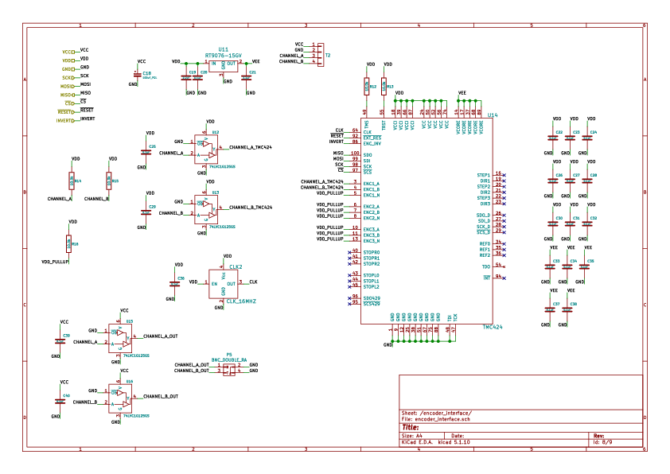
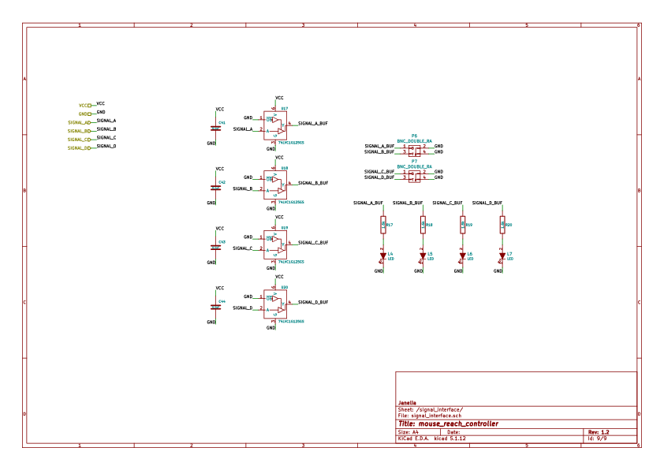

# Table of Contents

1.  [Repository Information](#orgac216ee)
    1.  [Description](#org6d4304b)
2.  [Images](#org9b96fdc)
3.  [Schematic](#org6dd55b8)
4.  [Gerbers](#org90d763e)
5.  [Bill of Materials](#org84dc3fa)
    1.  [PCB Parts](#org7fa1bf6)
    2.  [Supplemental Parts](#org51d3ad0)
    3.  [Vendor Parts Lists](#org9c47184)
6.  [Supplemental Documentation](#orgecaaf67)
    1.  [Assembly Instructions](#org7f00b43)
7.  [Manufacturing Archive](#org2282e9e)

# Repository Information

-   **Name:** mouse\_reach\_controller
-   **Version:** 1.0
-   **License:** Open-Source Hardware
-   **URL:** <https://github.com/janelia-kicad/mouse_reach_controller>
-   **Author:** Peter Polidoro
-   **Email:** peter@polidoro.io

## Description

This board controls the Hantman lab PelletDispenser rig and the RotaryDisk rig.

# Images

# Schematic

[./schematic/mouse\_reach\_controller.pdf](./schematic/mouse_reach_controller.pdf)

# Gerbers

# Bill of Materials

## PCB Parts

<table border="2" cellspacing="0" cellpadding="6" rules="groups" frame="hsides">

<colgroup>
<col  class="org-right" />

<col  class="org-left" />

<col  class="org-right" />

<col  class="org-left" />

<col  class="org-left" />

<col  class="org-left" />

<col  class="org-left" />

<col  class="org-left" />

<col  class="org-right" />
</colgroup>
<thead>
<tr>
<th scope="col" class="org-right">Item</th>
<th scope="col" class="org-left">Reference(s)</th>
<th scope="col" class="org-right">Quantity</th>
<th scope="col" class="org-left">Manufacturer</th>
<th scope="col" class="org-left">Manufacturer Part Number</th>
<th scope="col" class="org-left">Vendor</th>
<th scope="col" class="org-left">Vendor Part Number</th>
<th scope="col" class="org-left">Description</th>
<th scope="col" class="org-right">Package</th>
</tr>
</thead>

<tbody>
<tr>
<td class="org-right">1</td>
<td class="org-left">C1 C10 C11 C13 C15 C2 C20 C22 C23 C24 C25 C26 C27 C28 C29 C3 C30 C31 C32 C33 C34 C35 C36 C37 C38 C39 C4 C40 C41 C42 C43 C44 C5 C6 C7 C8</td>
<td class="org-right">36</td>
<td class="org-left">Yageo</td>
<td class="org-left">CC0402ZRY5V8BB104</td>
<td class="org-left">Digi-Key</td>
<td class="org-left">311-1375-1-ND</td>
<td class="org-left">CAP CER 0.1UF 25V Y5V</td>
<td class="org-right">0402</td>
</tr>

<tr>
<td class="org-right">2</td>
<td class="org-left">C12 C14 C16 C19 C21</td>
<td class="org-right">5</td>
<td class="org-left">TDK Corporation</td>
<td class="org-left">C1005X5R1V225K050BC</td>
<td class="org-left">Digi-Key</td>
<td class="org-left">445-9028-1-ND</td>
<td class="org-left">CAP CER 2.2UF 35V X5R</td>
<td class="org-right">0402</td>
</tr>

<tr>
<td class="org-right">3</td>
<td class="org-left">C17</td>
<td class="org-right">1</td>
<td class="org-left">YAGEO</td>
<td class="org-left">CC0402KRX5R7BB154</td>
<td class="org-left">Digi-Key</td>
<td class="org-left">13-CC0402KRX5R7BB154CT-ND</td>
<td class="org-left">CAP CER 0.15UF 16V X5R</td>
<td class="org-right">0402</td>
</tr>

<tr>
<td class="org-right">4</td>
<td class="org-left">C18 C9</td>
<td class="org-right">2</td>
<td class="org-left">Würth Elektronik</td>
<td class="org-left">865080545012</td>
<td class="org-left">Digi-Key</td>
<td class="org-left">732-8511-1-ND</td>
<td class="org-left">CAP ALUM 100UF 20% 35V</td>
<td class="org-right">&#xa0;</td>
</tr>

<tr>
<td class="org-right">5</td>
<td class="org-left">CLK1</td>
<td class="org-right">1</td>
<td class="org-left">Würth Elektronik</td>
<td class="org-left">831068248</td>
<td class="org-left">Digi-Key</td>
<td class="org-left">732-831068248CT-ND</td>
<td class="org-left">XTAL OSC XO 32.0000MHZ CMOS</td>
<td class="org-right">&#xa0;</td>
</tr>

<tr>
<td class="org-right">6</td>
<td class="org-left">CLK2</td>
<td class="org-right">1</td>
<td class="org-left">Würth Elektronik</td>
<td class="org-left">831066629</td>
<td class="org-left">Digi-Key</td>
<td class="org-left">732-831066629CT-ND</td>
<td class="org-left">XTAL OSC XO 16.0000MHZ CMOS</td>
<td class="org-right">&#xa0;</td>
</tr>

<tr>
<td class="org-right">7</td>
<td class="org-left">D1 D2</td>
<td class="org-right">2</td>
<td class="org-left">Nexperia USA Inc.</td>
<td class="org-left">PMEG45U10EPDAZ</td>
<td class="org-left">Digi-Key</td>
<td class="org-left">1727-7645-1-ND</td>
<td class="org-left">DIODE SCHOTTKY 45V 10A</td>
<td class="org-right">CFP15</td>
</tr>

<tr>
<td class="org-right">8</td>
<td class="org-left">I1</td>
<td class="org-right">1</td>
<td class="org-left">Murata Electronics</td>
<td class="org-left">BLM15PX601SN1D</td>
<td class="org-left">Digi-Key</td>
<td class="org-left">490-9657-1-ND</td>
<td class="org-left">FERRITE BEAD 600 OHM</td>
<td class="org-right">0402</td>
</tr>

<tr>
<td class="org-right">9</td>
<td class="org-left">J1</td>
<td class="org-right">1</td>
<td class="org-left">CUI Devices</td>
<td class="org-left">SJ-3523-SMT-TR</td>
<td class="org-left">Digi-Key</td>
<td class="org-left">CP-3523SJCT-ND</td>
<td class="org-left">3.50mm Headphone Phone Jack Stereo Connector Solder</td>
<td class="org-right">&#xa0;</td>
</tr>

<tr>
<td class="org-right">10</td>
<td class="org-left">L1 L2 L3 L4 L5 L6 L7</td>
<td class="org-right">7</td>
<td class="org-left">Kingbright</td>
<td class="org-left">APHHS1005LSECK/J3-PF</td>
<td class="org-left">Digi-Key</td>
<td class="org-left">754-2123-1-ND</td>
<td class="org-left">LED RED CLEAR 2SMD</td>
<td class="org-right">0402</td>
</tr>

<tr>
<td class="org-right">11</td>
<td class="org-left">P1 P2 P3</td>
<td class="org-right">3</td>
<td class="org-left">3M</td>
<td class="org-left">N3793-6302RB</td>
<td class="org-left">Digi-Key</td>
<td class="org-left">MHS10N-ND</td>
<td class="org-left">CONN HEADER VERT 10POS 2.54MM</td>
<td class="org-right">&#xa0;</td>
</tr>

<tr>
<td class="org-right">12</td>
<td class="org-left">P4</td>
<td class="org-right">1</td>
<td class="org-left">CUI Devices</td>
<td class="org-left">PJ-036AH-SMT-TR</td>
<td class="org-left">Digi-Key</td>
<td class="org-left">CP-036AHPJCT-ND</td>
<td class="org-left">CONN PWR JACK 2X5.5MM SOLDER</td>
<td class="org-right">&#xa0;</td>
</tr>

<tr>
<td class="org-right">13</td>
<td class="org-left">P5 P6 P7</td>
<td class="org-right">3</td>
<td class="org-left">Amphenol RF</td>
<td class="org-left">112661</td>
<td class="org-left">Digi-Key</td>
<td class="org-left">ACX1655-ND</td>
<td class="org-left">CONN BNC JACK R/A 75 OHM PCB</td>
<td class="org-right">&#xa0;</td>
</tr>

<tr>
<td class="org-right">14</td>
<td class="org-left">R1 R17 R18 R19 R20</td>
<td class="org-right">5</td>
<td class="org-left">YAGEO</td>
<td class="org-left">RC0402FR-071K6L</td>
<td class="org-left">Digi-Key</td>
<td class="org-left">YAG3045CT-ND</td>
<td class="org-left">RES 1.6K OHM 1% 1/16W</td>
<td class="org-right">0402</td>
</tr>

<tr>
<td class="org-right">15</td>
<td class="org-left">R10 R11 R8 R9</td>
<td class="org-right">4</td>
<td class="org-left">YAGEO</td>
<td class="org-left">RC0402FR-072K21L</td>
<td class="org-left">Digi-Key</td>
<td class="org-left">311-2.21KLRCT-ND</td>
<td class="org-left">RES 2.21K OHM 1% 1/16W</td>
<td class="org-right">0402</td>
</tr>

<tr>
<td class="org-right">16</td>
<td class="org-left">R12 R13 R14 R15 R16</td>
<td class="org-right">5</td>
<td class="org-left">YAGEO</td>
<td class="org-left">RC0402JR-0710KL</td>
<td class="org-left">Digi-Key</td>
<td class="org-left">311-10KJRCT-ND</td>
<td class="org-left">RES SMD 10K OHM 5% 1/10W</td>
<td class="org-right">0402</td>
</tr>

<tr>
<td class="org-right">17</td>
<td class="org-left">R2 R3 R4 R5 R6 R7</td>
<td class="org-right">6</td>
<td class="org-left">Stackpole Electronics Inc</td>
<td class="org-left">RMCF0402FT100R</td>
<td class="org-left">Digi-Key</td>
<td class="org-left">RMCF0402FT100RCT-ND</td>
<td class="org-left">RES 100 OHM 1% 1/16W</td>
<td class="org-right">0402</td>
</tr>

<tr>
<td class="org-right">18</td>
<td class="org-left">T1</td>
<td class="org-right">1</td>
<td class="org-left">Phoenix Contact</td>
<td class="org-left">1757242</td>
<td class="org-left">Digi-Key</td>
<td class="org-left">277-1106-ND</td>
<td class="org-left">TERM BLOCK HDR 2POS 90DEG 5.08MM</td>
<td class="org-right">&#xa0;</td>
</tr>

<tr>
<td class="org-right">19</td>
<td class="org-left">T2</td>
<td class="org-right">1</td>
<td class="org-left">Phoenix Contact</td>
<td class="org-left">1757268</td>
<td class="org-left">Digi-Key</td>
<td class="org-left">277-1108-ND</td>
<td class="org-left">TERM BLOCK HDR 4POS 90DEG 5.08MM</td>
<td class="org-right">&#xa0;</td>
</tr>

<tr>
<td class="org-right">20</td>
<td class="org-left">TEENSY1</td>
<td class="org-right">28</td>
<td class="org-left">Mill-Max Manufacturing Corp.</td>
<td class="org-left">0305-0-15-15-47-27-10-0</td>
<td class="org-left">Digi-Key</td>
<td class="org-left">ED90331-ND</td>
<td class="org-left">CONN PIN RCPT .025-.037 SOLDER</td>
<td class="org-right">&#xa0;</td>
</tr>

<tr>
<td class="org-right">21</td>
<td class="org-left">U1</td>
<td class="org-right">1</td>
<td class="org-left">Trinamic Motion Control GmbH</td>
<td class="org-left">TMC429-LI-T</td>
<td class="org-left">Digi-Key</td>
<td class="org-left">1460-1071-1-ND</td>
<td class="org-left">IC MOTOR CONTROLLER SPI 32QFN</td>
<td class="org-right">&#xa0;</td>
</tr>

<tr>
<td class="org-right">22</td>
<td class="org-left">U10</td>
<td class="org-right">1</td>
<td class="org-left">NXP USA Inc.</td>
<td class="org-left">SGTL5000XNAA3R2</td>
<td class="org-left">Digi-Key</td>
<td class="org-left">SGTL5000XNAA3R2CT-ND</td>
<td class="org-left">Stereo Audio Interface 32-QFN</td>
<td class="org-right">&#xa0;</td>
</tr>

<tr>
<td class="org-right">23</td>
<td class="org-left">U11 U9</td>
<td class="org-right">2</td>
<td class="org-left">Richtek USA Inc.</td>
<td class="org-left">RT9076-15GV</td>
<td class="org-left">Digi-Key</td>
<td class="org-left">1028-1470-1-ND</td>
<td class="org-left">IC REG LINEAR 1.5V 250MA</td>
<td class="org-right">SOT23-3</td>
</tr>

<tr>
<td class="org-right">24</td>
<td class="org-left">U12 U13 U15 U16 U17 U18 U19 U20 U3 U5 U7</td>
<td class="org-right">11</td>
<td class="org-left">Nexperia USA Inc.</td>
<td class="org-left">74LVC1G125GS,132</td>
<td class="org-left">Digi-Key</td>
<td class="org-left">1727-8033-1-ND</td>
<td class="org-left">IC BUF NON-INVERT 5.5V</td>
<td class="org-right">6-XFDFN</td>
</tr>

<tr>
<td class="org-right">25</td>
<td class="org-left">U14</td>
<td class="org-right">1</td>
<td class="org-left">Trinamic Motion Control GmbH</td>
<td class="org-left">TMC424</td>
<td class="org-left">Digi-Key</td>
<td class="org-left">1460-1046-ND</td>
<td class="org-left">IC INTERFACE SPECIALIZED</td>
<td class="org-right">&#xa0;</td>
</tr>

<tr>
<td class="org-right">26</td>
<td class="org-left">U2 U4 U6</td>
<td class="org-right">3</td>
<td class="org-left">Texas Instruments</td>
<td class="org-left">SN65LVDM050QDRQ1</td>
<td class="org-left">Digi-Key</td>
<td class="org-left">296-15386-1-ND</td>
<td class="org-left">IC TRANSCEIVER FULL 2/2</td>
<td class="org-right">16-SOIC</td>
</tr>

<tr>
<td class="org-right">27</td>
<td class="org-left">U8</td>
<td class="org-right">1</td>
<td class="org-left">Diodes Incorporated</td>
<td class="org-left">ZXMS6006SGTA</td>
<td class="org-left">Digi-Key</td>
<td class="org-left">ZXMS6006SGTADICT-ND</td>
<td class="org-left">IC PWR DRIVER N-CHAN 1:1</td>
<td class="org-right">SOT223</td>
</tr>

<tr>
<td class="org-right">&#xa0;</td>
<td class="org-left">FID1 FID2 FID3 FID4 MH1 MH2 MH3 MH4</td>
<td class="org-right">8</td>
<td class="org-left">&#xa0;</td>
<td class="org-left">&#xa0;</td>
<td class="org-left">&#xa0;</td>
<td class="org-left">&#xa0;</td>
<td class="org-left">&#xa0;</td>
<td class="org-right">&#xa0;</td>
</tr>
</tbody>
</table>

## Supplemental Parts

<table border="2" cellspacing="0" cellpadding="6" rules="groups" frame="hsides">

<colgroup>
<col  class="org-right" />

<col  class="org-right" />

<col  class="org-left" />

<col  class="org-right" />

<col  class="org-left" />

<col  class="org-left" />

<col  class="org-left" />
</colgroup>
<thead>
<tr>
<th scope="col" class="org-right">Item</th>
<th scope="col" class="org-right">Quantity</th>
<th scope="col" class="org-left">Manufacturer</th>
<th scope="col" class="org-right">Manufacturer Part Number</th>
<th scope="col" class="org-left">Vendor</th>
<th scope="col" class="org-left">Vendor Part Number</th>
<th scope="col" class="org-left">Description</th>
</tr>
</thead>

<tbody>
<tr>
<td class="org-right">1</td>
<td class="org-right">1</td>
<td class="org-left">SparkFun Electronics</td>
<td class="org-right">DEV-15583</td>
<td class="org-left">Digi-Key</td>
<td class="org-left">1568-DEV-15583-ND</td>
<td class="org-left">TEENSY 4.0</td>
</tr>

<tr>
<td class="org-right">2</td>
<td class="org-right">2</td>
<td class="org-left">Molex</td>
<td class="org-right">0022284146</td>
<td class="org-left">Digi-Key</td>
<td class="org-left">WM24210-ND</td>
<td class="org-left">CONN HEADER VERT 14POS 2.54MM</td>
</tr>

<tr>
<td class="org-right">3</td>
<td class="org-right">1</td>
<td class="org-left">Qualtek</td>
<td class="org-right">3021075-03</td>
<td class="org-left">Digi-Key</td>
<td class="org-left">Q1223-ND</td>
<td class="org-left">USB 2.0 A MALE TO USB 2.0 MICRO</td>
</tr>
</tbody>
</table>

## Vendor Parts Lists

[./bom/Digi-Key\_parts.csv](./bom/Digi-Key_parts.csv)

[./bom/supplemental\_Digi-Key\_parts.csv](./bom/supplemental_Digi-Key_parts.csv)

# Supplemental Documentation

## Assembly Instructions

-   Solder surface mount and through hole components onto the pcb.

# Manufacturing Archive

Send manufacturing zip file to your favorite PCB manufacturer for fabrication.

[./manufacturing/mouse\_reach\_controller\_v1.0.zip](./manufacturing/mouse_reach_controller_v1.0.zip)

