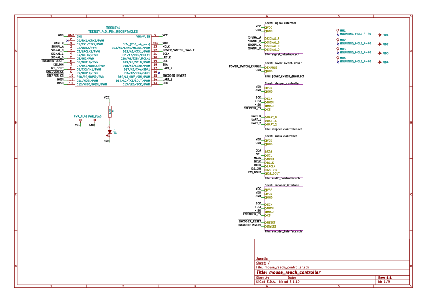
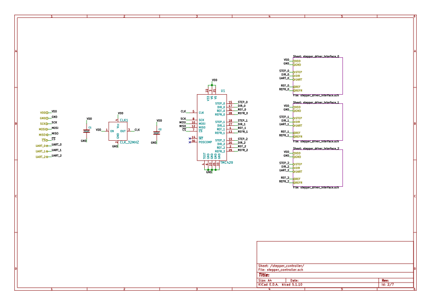
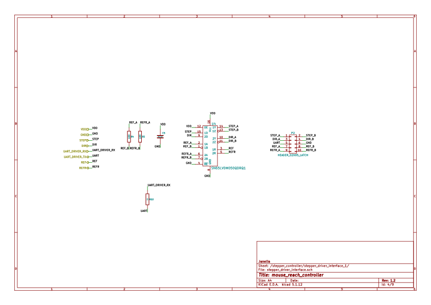
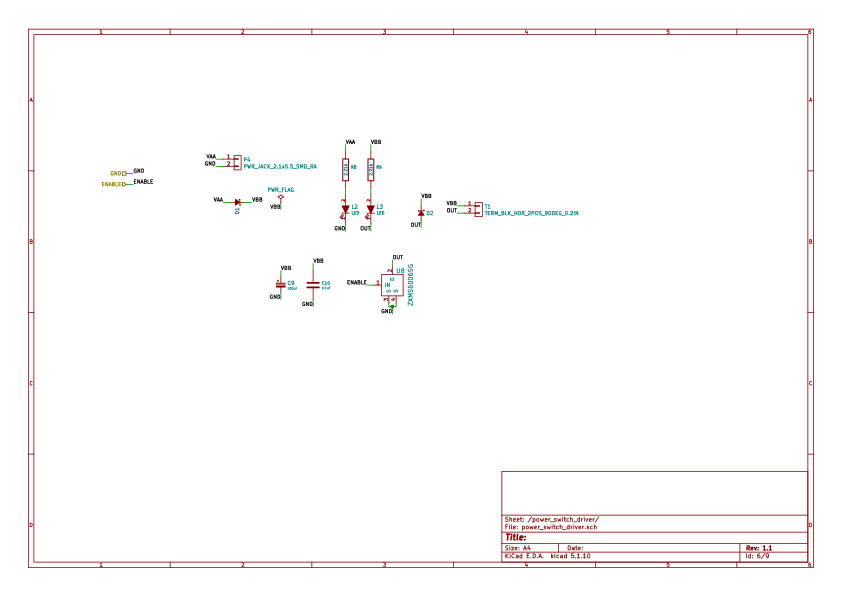
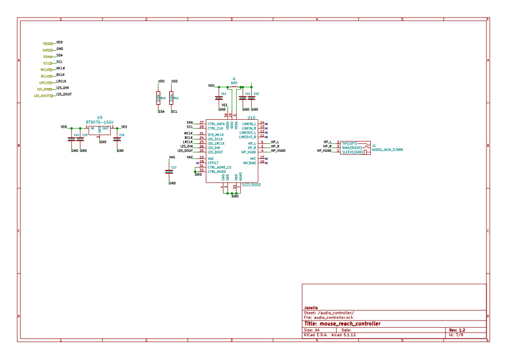

# Table of Contents

1.  [Repository Information](#orgc018c63)
    1.  [Description](#orge9087c7)
2.  [Images](#orgd6efd9e)
3.  [Schematic](#orge671a81)
4.  [Gerbers](#org8eb55c3)
5.  [Bill of Materials](#org113ca7a)
    1.  [PCB Parts](#orgc5c71eb)
    2.  [Supplemental Parts](#orgea4efb9)
    3.  [Vendor Parts Lists](#org3c15dbf)
6.  [Supplemental Documentation](#org4fd4226)
    1.  [Assembly Instructions](#org9cb6e11)
7.  [Manufacturing Archive](#org9c00308)

# Repository Information

-   **Name:** mouse\_reach\_controller
-   **Version:** 1.0
-   **License:** Open-Source Hardware
-   **URL:** <https://github.com/janelia-kicad/mouse_reach_controller>
-   **Author:** Peter Polidoro
-   **Email:** peter@polidoro.io

## Description

This board controls the Hantman lab PelletDispenser rig and the RotaryDisk rig.

# Images

# Schematic

[./schematic/mouse\_reach\_controller.pdf](./schematic/mouse_reach_controller.pdf)

# Gerbers

# Bill of Materials

## PCB Parts

<table border="2" cellspacing="0" cellpadding="6" rules="groups" frame="hsides">

<colgroup>
<col  class="org-right" />

<col  class="org-left" />

<col  class="org-right" />

<col  class="org-left" />

<col  class="org-left" />

<col  class="org-left" />

<col  class="org-left" />

<col  class="org-left" />

<col  class="org-right" />
</colgroup>
<thead>
<tr>
<th scope="col" class="org-right">Item</th>
<th scope="col" class="org-left">Reference(s)</th>
<th scope="col" class="org-right">Quantity</th>
<th scope="col" class="org-left">Manufacturer</th>
<th scope="col" class="org-left">Manufacturer Part Number</th>
<th scope="col" class="org-left">Vendor</th>
<th scope="col" class="org-left">Vendor Part Number</th>
<th scope="col" class="org-left">Description</th>
<th scope="col" class="org-right">Package</th>
</tr>
</thead>

<tbody>
<tr>
<td class="org-right">1</td>
<td class="org-left">C1 C10 C12 C14 C2 C3 C4 C5 C6 C7 C8</td>
<td class="org-right">11</td>
<td class="org-left">Yageo</td>
<td class="org-left">CC0402ZRY5V8BB104</td>
<td class="org-left">Digi-Key</td>
<td class="org-left">311-1375-1-ND</td>
<td class="org-left">CAP CER 0.1UF 25V Y5V</td>
<td class="org-right">0402</td>
</tr>

<tr>
<td class="org-right">2</td>
<td class="org-left">C11 C13 C15 C9</td>
<td class="org-right">4</td>
<td class="org-left">TDK Corporation</td>
<td class="org-left">C1005X5R1V225K050BC</td>
<td class="org-left">Digi-Key</td>
<td class="org-left">445-9028-1-ND</td>
<td class="org-left">CAP CER 2.2UF 35V X5R</td>
<td class="org-right">0402</td>
</tr>

<tr>
<td class="org-right">3</td>
<td class="org-left">C16</td>
<td class="org-right">1</td>
<td class="org-left">YAGEO</td>
<td class="org-left">CC0402KRX5R7BB154</td>
<td class="org-left">Digi-Key</td>
<td class="org-left">13-CC0402KRX5R7BB154CT-ND</td>
<td class="org-left">CAP CER 0.15UF 16V X5R</td>
<td class="org-right">0402</td>
</tr>

<tr>
<td class="org-right">4</td>
<td class="org-left">CLK1</td>
<td class="org-right">1</td>
<td class="org-left">CTS-Frequency Controls</td>
<td class="org-left">CB3LV-3C-32M000000</td>
<td class="org-left">Digi-Key</td>
<td class="org-left">CTX277LVCT-ND</td>
<td class="org-left">XTAL OSC XO 32.0000MHZ HCMOS TTL</td>
<td class="org-right">&#xa0;</td>
</tr>

<tr>
<td class="org-right">5</td>
<td class="org-left">D1</td>
<td class="org-right">1</td>
<td class="org-left">Comchip Technology</td>
<td class="org-left">CDBQR0230L</td>
<td class="org-left">Digi-Key</td>
<td class="org-left">641-1275-1-ND</td>
<td class="org-left">DIODE SCHOTTKY 30V 200MA</td>
<td class="org-right">0402</td>
</tr>

<tr>
<td class="org-right">6</td>
<td class="org-left">J1</td>
<td class="org-right">1</td>
<td class="org-left">CUI Devices</td>
<td class="org-left">SJ-3523-SMT-TR</td>
<td class="org-left">Digi-Key</td>
<td class="org-left">CP-3523SJCT-ND</td>
<td class="org-left">3.50mm Headphone Phone Jack Stereo Connector Solder</td>
<td class="org-right">&#xa0;</td>
</tr>

<tr>
<td class="org-right">7</td>
<td class="org-left">L1</td>
<td class="org-right">1</td>
<td class="org-left">Taiyo Yuden</td>
<td class="org-left">FBMH3225HM601NT</td>
<td class="org-left">Digi-Key</td>
<td class="org-left">587-1755-1-ND</td>
<td class="org-left">FERRITE BEAD 600 OHM 1210 1LN</td>
<td class="org-right">&#xa0;</td>
</tr>

<tr>
<td class="org-right">8</td>
<td class="org-left">P1 P2 P3</td>
<td class="org-right">3</td>
<td class="org-left">3M</td>
<td class="org-left">N3793-6302RB</td>
<td class="org-left">Digi-Key</td>
<td class="org-left">MHS10N-ND</td>
<td class="org-left">CONN HEADER VERT 10POS 2.54MM</td>
<td class="org-right">&#xa0;</td>
</tr>

<tr>
<td class="org-right">9</td>
<td class="org-left">R1 R2 R3 R4 R5 R6</td>
<td class="org-right">6</td>
<td class="org-left">Stackpole Electronics Inc</td>
<td class="org-left">RMCF0402FT100R</td>
<td class="org-left">Digi-Key</td>
<td class="org-left">RMCF0402FT100RCT-ND</td>
<td class="org-left">RES 100 OHM 1% 1/16W</td>
<td class="org-right">0402</td>
</tr>

<tr>
<td class="org-right">10</td>
<td class="org-left">R7 R8</td>
<td class="org-right">2</td>
<td class="org-left">YAGEO</td>
<td class="org-left">RC0402FR-072K21L</td>
<td class="org-left">Digi-Key</td>
<td class="org-left">311-2.21KLRCT-ND</td>
<td class="org-left">RES 2.21K OHM 1% 1/16W</td>
<td class="org-right">0402</td>
</tr>

<tr>
<td class="org-right">11</td>
<td class="org-left">T1</td>
<td class="org-right">1</td>
<td class="org-left">Phoenix Contact</td>
<td class="org-left">1757242</td>
<td class="org-left">Digi-Key</td>
<td class="org-left">277-1106-ND</td>
<td class="org-left">TERM BLOCK HDR 2POS 90DEG 5.08MM</td>
<td class="org-right">&#xa0;</td>
</tr>

<tr>
<td class="org-right">12</td>
<td class="org-left">TEENSY1</td>
<td class="org-right">28</td>
<td class="org-left">Mill-Max Manufacturing Corp.</td>
<td class="org-left">0305-0-15-15-47-27-10-0</td>
<td class="org-left">Digi-Key</td>
<td class="org-left">ED90331-ND</td>
<td class="org-left">CONN PIN RCPT .025-.037 SOLDER</td>
<td class="org-right">&#xa0;</td>
</tr>

<tr>
<td class="org-right">13</td>
<td class="org-left">U1</td>
<td class="org-right">1</td>
<td class="org-left">Trinamic Motion Control GmbH</td>
<td class="org-left">TMC429-LI-T</td>
<td class="org-left">Digi-Key</td>
<td class="org-left">1460-1071-1-ND</td>
<td class="org-left">IC MOTOR CONTROLLER SPI 32QFN</td>
<td class="org-right">&#xa0;</td>
</tr>

<tr>
<td class="org-right">14</td>
<td class="org-left">U10</td>
<td class="org-right">1</td>
<td class="org-left">NXP USA Inc.</td>
<td class="org-left">SGTL5000XNAA3R2</td>
<td class="org-left">Digi-Key</td>
<td class="org-left">SGTL5000XNAA3R2CT-ND</td>
<td class="org-left">Stereo Audio Interface 32-QFN</td>
<td class="org-right">&#xa0;</td>
</tr>

<tr>
<td class="org-right">15</td>
<td class="org-left">U2 U4 U6</td>
<td class="org-right">3</td>
<td class="org-left">Texas Instruments</td>
<td class="org-left">SN65LVDM050QDRQ1</td>
<td class="org-left">Digi-Key</td>
<td class="org-left">296-15386-1-ND</td>
<td class="org-left">IC TRANSCEIVER FULL 2/2</td>
<td class="org-right">16-SOIC</td>
</tr>

<tr>
<td class="org-right">16</td>
<td class="org-left">U3 U5 U7</td>
<td class="org-right">3</td>
<td class="org-left">ON Semiconductor</td>
<td class="org-left">NC7SZ125FHX</td>
<td class="org-left">Digi-Key</td>
<td class="org-left">NC7SZ125FHXCT-ND</td>
<td class="org-left">IC BUF NON-INVERT 5.5V</td>
<td class="org-right">6-UFDFN</td>
</tr>

<tr>
<td class="org-right">17</td>
<td class="org-left">U8</td>
<td class="org-right">1</td>
<td class="org-left">Microchip Technology</td>
<td class="org-left">MIC94091YC6-TR</td>
<td class="org-left">Digi-Key</td>
<td class="org-left">576-3486-1-ND</td>
<td class="org-left">IC PWR SWITCH P-CHAN 1:1</td>
<td class="org-right">&#xa0;</td>
</tr>

<tr>
<td class="org-right">18</td>
<td class="org-left">U9</td>
<td class="org-right">1</td>
<td class="org-left">Richtek USA Inc.</td>
<td class="org-left">RT9076-15GV</td>
<td class="org-left">Digi-Key</td>
<td class="org-left">1028-1470-1-ND</td>
<td class="org-left">IC REG LINEAR 1.5V 250MA</td>
<td class="org-right">SOT23-3</td>
</tr>

<tr>
<td class="org-right">&#xa0;</td>
<td class="org-left">FID1 FID2 FID3 FID4 MH1 MH2 MH3 MH4</td>
<td class="org-right">8</td>
<td class="org-left">&#xa0;</td>
<td class="org-left">&#xa0;</td>
<td class="org-left">&#xa0;</td>
<td class="org-left">&#xa0;</td>
<td class="org-left">&#xa0;</td>
<td class="org-right">&#xa0;</td>
</tr>
</tbody>
</table>

## Supplemental Parts

<table border="2" cellspacing="0" cellpadding="6" rules="groups" frame="hsides">

<colgroup>
<col  class="org-right" />

<col  class="org-right" />

<col  class="org-left" />

<col  class="org-right" />

<col  class="org-left" />

<col  class="org-left" />

<col  class="org-left" />
</colgroup>
<thead>
<tr>
<th scope="col" class="org-right">Item</th>
<th scope="col" class="org-right">Quantity</th>
<th scope="col" class="org-left">Manufacturer</th>
<th scope="col" class="org-right">Manufacturer Part Number</th>
<th scope="col" class="org-left">Vendor</th>
<th scope="col" class="org-left">Vendor Part Number</th>
<th scope="col" class="org-left">Description</th>
</tr>
</thead>

<tbody>
<tr>
<td class="org-right">1</td>
<td class="org-right">1</td>
<td class="org-left">SparkFun Electronics</td>
<td class="org-right">DEV-15583</td>
<td class="org-left">Digi-Key</td>
<td class="org-left">1568-DEV-15583-ND</td>
<td class="org-left">TEENSY 4.0</td>
</tr>

<tr>
<td class="org-right">2</td>
<td class="org-right">2</td>
<td class="org-left">Molex</td>
<td class="org-right">0022284146</td>
<td class="org-left">Digi-Key</td>
<td class="org-left">WM24210-ND</td>
<td class="org-left">CONN HEADER VERT 14POS 2.54MM</td>
</tr>

<tr>
<td class="org-right">3</td>
<td class="org-right">1</td>
<td class="org-left">Qualtek</td>
<td class="org-right">3021075-03</td>
<td class="org-left">Digi-Key</td>
<td class="org-left">Q1223-ND</td>
<td class="org-left">USB 2.0 A MALE TO USB 2.0 MICRO</td>
</tr>
</tbody>
</table>

## Vendor Parts Lists

[./bom/Digi-Key\_parts.csv](./bom/Digi-Key_parts.csv)

[./bom/supplemental\_Digi-Key\_parts.csv](./bom/supplemental_Digi-Key_parts.csv)

# Supplemental Documentation

## Assembly Instructions

-   Solder surface mount and through hole components onto the pcb.

# Manufacturing Archive

Send manufacturing zip file to your favorite PCB manufacturer for fabrication.

[./manufacturing/mouse\_reach\_controller\_v1.0.zip](./manufacturing/mouse_reach_controller_v1.0.zip)

